# PathManagerPlus

一个用来管理文件，文件夹，链接等路径的软件。

## 安装方法

### 从安装包安装

点击对应的 .exe 安装包进行安装。需要注意的是，软件需要安装在有写入权限的路径下。否则使用软件时尝试的配置文件和数据文件由于无法写入会产生一些意外行为。

### 从代码运行

#### 依赖环境

- Python 3.8+
- PySide6
- 无其他依赖

#### 安装相关的 python package

```
pip install pyside6
```

#### 将 .ui 生成对应的 .py 文件

进入 console 界面 ui 的路径(PathManagerPlus\PathManagerPlus\ui)下，运行

```
pyside6-uic main_window.ui -o main_window.py
pyside6-uic config_form.ui -o config_form.py
pyside6-uic add_path_form.ui -o add_path_form.py
```

#### 运行程序

通过 `python run.py` 可运行程序，或直接双击 run.py。默认情况下会弹出一个 console 界面，如果在 windows 下，想直接通过双击来使用，可以将 `run.py` 改成 `run.pyw`，这样就可以直接双击 `run.pyw` 运行并且没有 console 窗口了。

## 系统支持

| 操作系统   | 支持状态   | 说明                                                   |
| ---------- | ---------- | ------------------------------------------------------ |
| Windows 7  | ❌ 不支持     | 可选择PySide2分支。可用，但不再更新。 |
| Windows 10 | ✅ 支持     | 主开发/测试平台                                        |
| Windows 11 | ✅ 支持 |                                  |
| Linux      | 🚧 开发中   | 基本功能可用，已适配部分系统                             |
| macOS      | ✅ 支持   |  |


## 软件界面

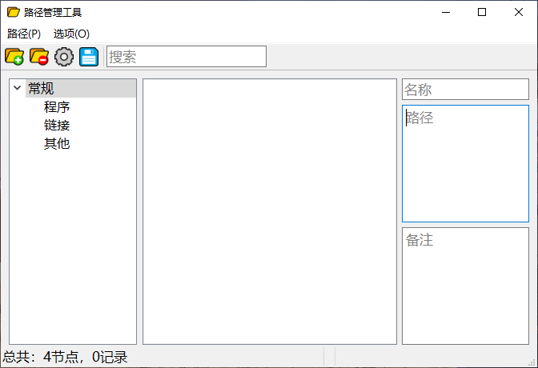

## 功能区域说明

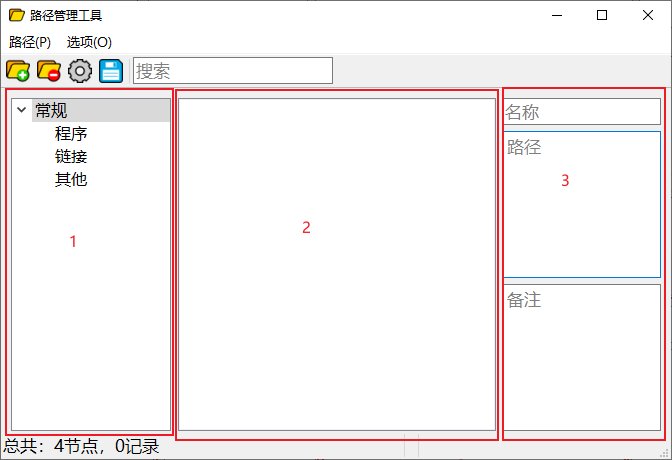

- 区域 1: 树控件，上面的节点都支持拖拽。不过每次拖拽只能一项。支持添加和删除节点。支持重命名。总之按照自己喜欢的方式进行规划。
- 区域2: 列表控件。
- 区域3: 信息显示区域

## 使用方式

我们在外面选中一些文件夹或者文件，直接拖拽到功能区域 2 的列表框上面，支持一次性多个。比如我在桌面随便新建几个文件，然后把它们拖进来。按 `Ctrl+S` 保存(或者点击工具栏的按钮)。

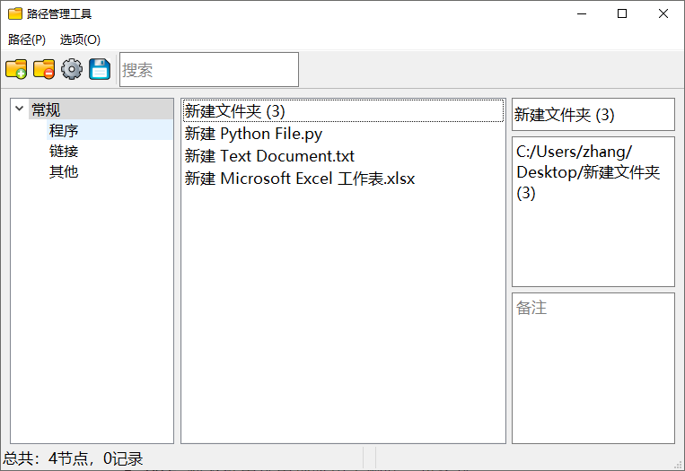

先行说明：**在这个程序上所做的行为不会对原文件造成影响。**同样的，当原文件位置转移后，这里不会自动更新这个行为。

### 功能介绍

可以在区域 3 的名称部分进行更改，改成自己喜欢的名字，切换焦点(比如按 Enter 或者点击别的控件)，就会自动更新到列表框里。同样地，路径部分也可以自己更新，备注里面可以写自己想记录的东西。

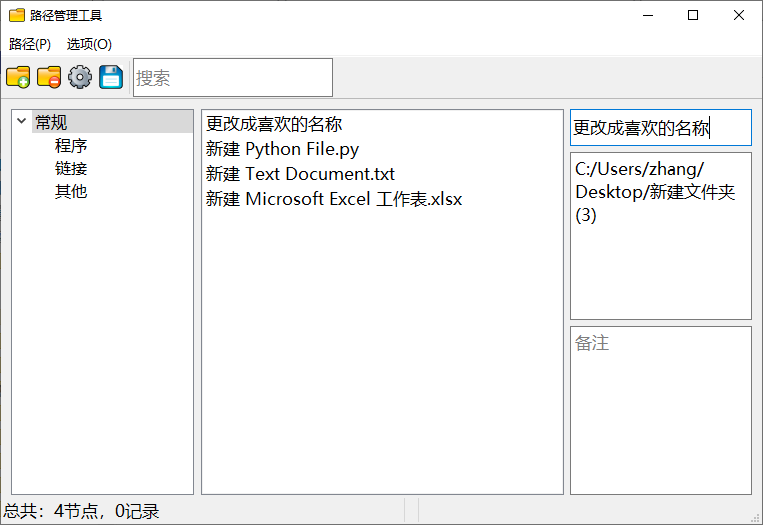

关于排序和拖动，可看后面的 界面功能 部分。

### 拖拽

**对于左边树的每一个树节点，都可以进行拖拽。没有层级限制。中间列表框中的每一项，可以自由拖动到其他树节点中，可以一次拖动多项。**

请自己实际测试一下就知道我在说什么了。

### 功能一：双击打开目标文件

在区域 2 列表框中的每一项，使用鼠标双击的时候，可以使用系统自带的方式打开目标项。对于文件夹是打开文件夹，对于文件则是打开文件，程序则是运行程序。**该功能绑定了 `Enter` 快捷键。支持多选按快捷键一次打开多个，但是当前限制一次最多打开 5 个。**

在 windows 下，也可以有这种行为，比如：

新建一个 `hello.py` 文件，并写上以下代码。然后拖动到界面上

```python
import os

print('Hello World!')
os.system('pause')
```

鼠标双击这一项后，就可以直接运行：

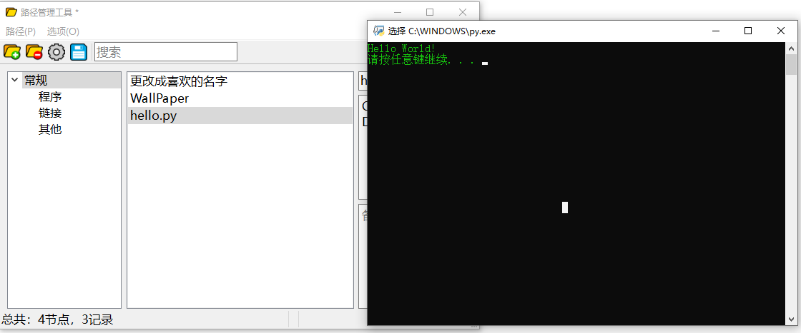

### 功能二：右键菜单

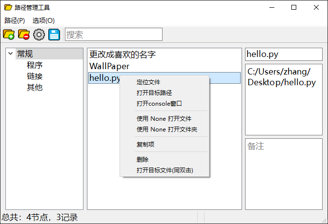

#### 定位文件

顾名思义，定位到目标位置并选中。相比打开目标路径，存在着些许差异。具体差异请自行测试很快就了解了。速度相对也慢了一点点。

#### 打开目标路径

直接进入到目标路径下。相比定位文件来说，速度比较快。功能也有所差异。

#### 打开 console 窗口

直接在目标路径下开一个 console 窗口出来。在一些场景下有其意义。

#### 右键菜单中间那两项

这部分的使用场景是：支持你设定一个编辑器，用来打开文件和文件夹。在设置里面进行配置，前提是目标的命令行支持打开文件和文件夹这两个功能。比如，这里以 Sublime Text 为例：

点击工具栏上的配置图标(或者在菜单栏里面激活)

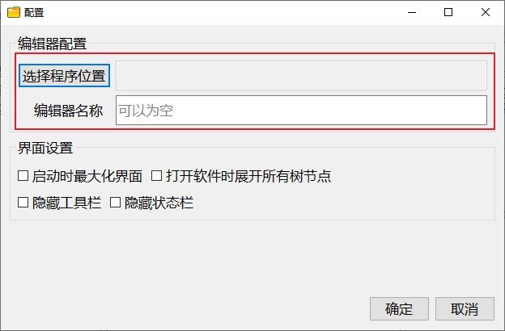

点击 `选择程序位置` 按钮，选中自己想要的目标编辑器。

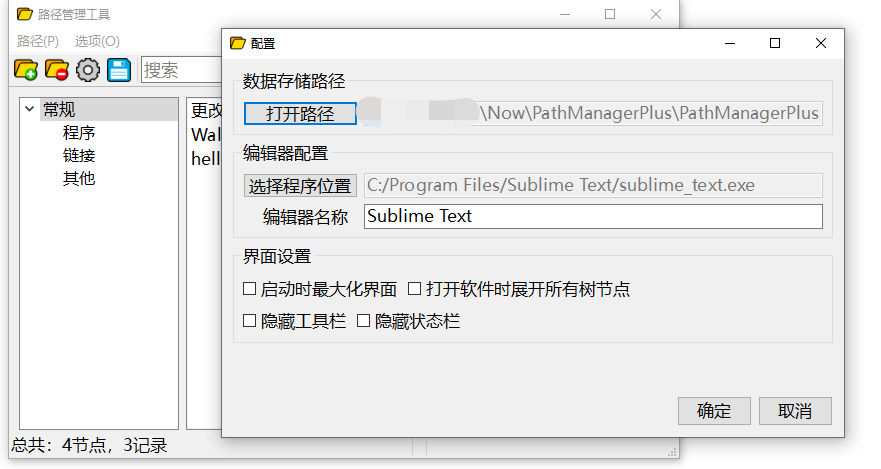

点击 `确定`。

然后主界面的右键菜单就变成：

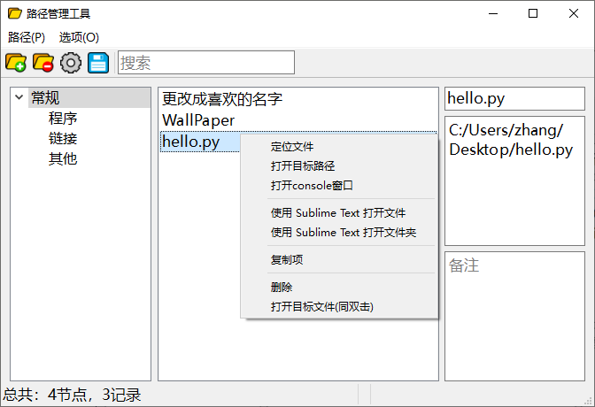

### 功能三：打开 url

此功能某种意义上算是上面功能的一个拓展。

按快捷键 `Ctrl+N` 或者点击工具栏上的图标，弹出这个窗口。比如我们添加 python 官网：

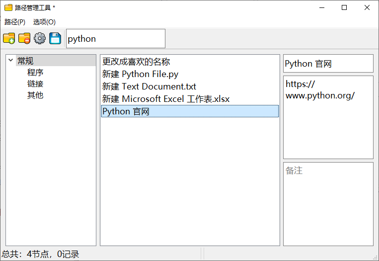

你也可以将它拖到自己想要的位置：
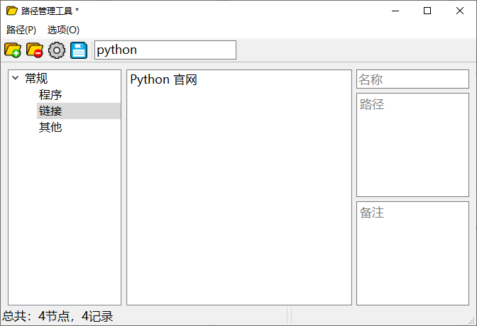

然后，双击即可使用默认浏览器打开。

### 节点排序

可以在树节点上对节点的列表项进行快捷排序。如果需要的话。

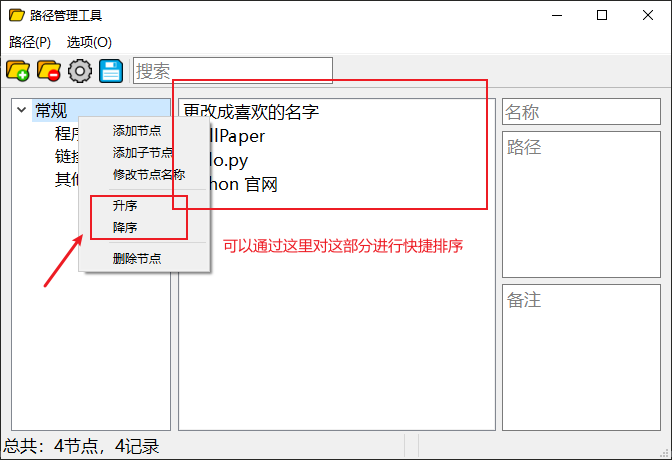

### 搜索功能

搜索功能目前很简单。底层逻辑就是，将 name + path + comment 合在一起，然后提取搜索的词，如果在里面则命中返回结果。在焦点在搜索框中时，可以按 `Esc` 快捷键快速清空搜索框退出搜索模式，方便进行多次搜索。

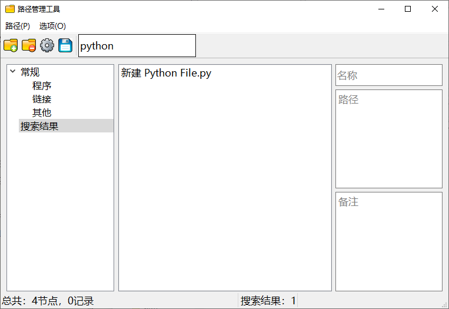

## 界面功能

### 列表内排序

对于列表上的项，可以拖拽按照自己喜欢的顺序排放。目前在列表框中的顺序排放部分，每次只能一项。多项只有一项生效(后续可能对此功能进行增强)。

### 跨树枝拖放

可以在列表框中选中多项，然后拖动到区域 1 别的树枝上放下。

## 相关快捷键

- `Ctrl+N`: 弹出添加路径窗口
- `Ctrl+S`: 保存数据
- `Del`: 列表框中选中项时用于删除，可多选
- `Esc`: 在搜索模式下，焦点在搜索框中时可用于清空搜索值，方便快速搜索
- `Enter`: 在列表框中，按 `Enter` 可用于打开对应项。支持多选，目前限制为一次性最多打开 5 项。

